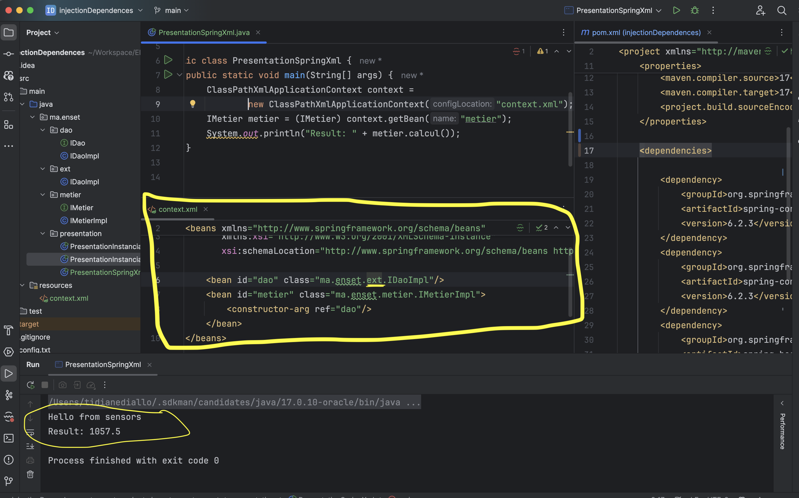

## Dependencies injection application
this application is a simple example of how to use the dependency injection in java using( or not) the spring framework.
### Statique injection for the database

### Statique injection for the sensors

### Dynamique injection for the database

### Dynamique injection for the sensors

### Dependency injection using spring and XML for the database

### Dependency injection using spring and XML for the sensors

### Dependency injection using spring and annotations for the database

### Dependency injection using spring and annotations for the sensors

